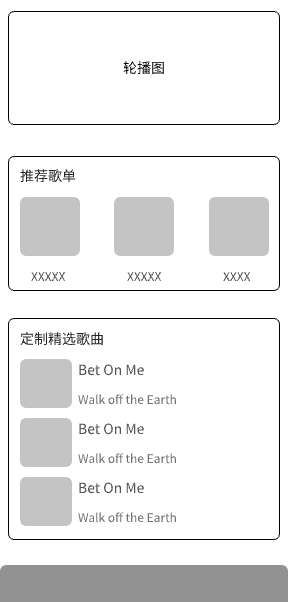
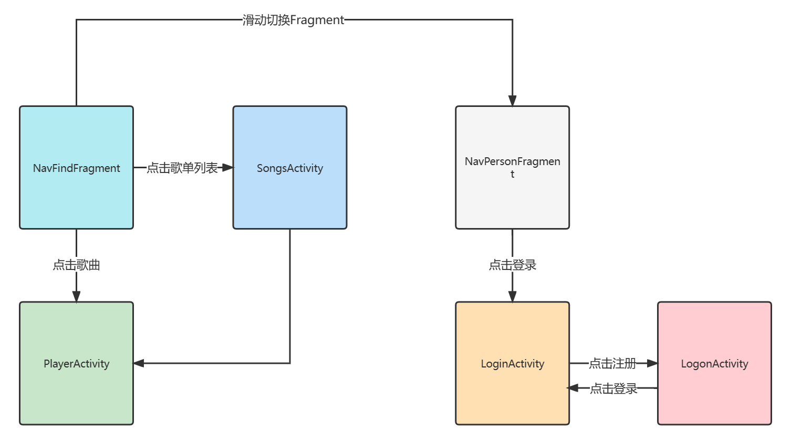

# 项目介绍

一个网络音乐播放器，歌曲的来源是网络，没有实现本地歌曲的播放功能。

用到的三方库：

1. Banner
2. Glide
3. LitePal

开发语言：Kotlin + Java

# 项目设计

## 数据库设计

涉及到的实体类有：Song、Songs、User。Songs 与 Song 是多对一的关系。Songs 是歌单，歌单下面有许多的歌曲对象。

请运行下面的歌曲数据源代码，放在 MainActivity 中执行一次即可：

```kotlin
Song(
  "https://p2.music.126.net/z_Mf8OfATNV2O-4V0eub1Q==/109951164255539403.jpg?param=130y130",
  "我家里有蜘蛛！！！",
  "warma",
  "http://m10.music.126.net/20221216100643/f81b3679dd5977d35a69a266c03d5410/ymusic/535f/5308/0e08/d50677485edb749982859b3c5e26892a.mp3"
).save()

Song(
  "https://p2.music.126.net/DwWVQH2lsnqJEpeUiNaCZA==/109951164416460276.jpg?param=130y130",
  "I really ∞",
  "warma",
  "http://m10.music.126.net/20221216100615/c35e1a05c534d893c1652185da4f4d9c/ymusic/0452/070f/0f5d/38eafc068f0e425b2a88877846535d21.mp3"
).save()

Song(
  "https://p2.music.126.net/Mw7z4vn0EMrWlitsiYgzPQ==/109951163606870393.jpg?param=130y130",
  "Everything's Alright",
  "Hanser",
  "http://m10.music.126.net/20221216100544/179c376d4a66cebf5c75e72276f5185f/ymusic/obj/w5zDlMODwrDDiGjCn8Ky/3192845784/fc9d/0f37/ce40/09089c635ade9fcee5c64bc456b6ec91.mp3"
).save()

Song(
  "https://p1.music.126.net/o7VzAqAtOoSr14Kbq2O-uA==/7834020348009169.jpg?param=130y130",
  "PEKO PEKO PEKO",
  "Dyako",
  "http://m10.music.126.net/20221216100415/d56119f612454a630e778a207325eb9f/ymusic/0e52/030e/565b/988ed4ee024d921187dca197dbdc003e.mp3"
).save()

Song(
  "https://p1.music.126.net/o7VzAqAtOoSr14Kbq2O-uA==/7834020348009169.jpg?param=130y130",
  "兎田ぺこらの世界",
  "Dyako",
  "http://m701.music.126.net/20221216100339/2a6f0e2547eab927226889f6521df1de/jdymusic/obj/w5zDlMODwrDDiGjCn8Ky/2030786366/adcd/e437/1a07/eeb4dc1da6afe349696c23ba4163fa4e.mp3"
).save()
```

下面代码同上：

```kotlin
Songs(
  "【ACG】盘点2022年百首好听的动漫歌曲",
  "https://p4.music.126.net/gHt8N6_q7ZW_QQzRuFGjdA==/109951167919926215.jpg?param=200y200"
).save()

Songs(
  "日系治愈 | 微风轻轻起 我好喜欢你",
  "https://p4.music.126.net/8fbidxSiVOY23qwcHYt6cQ==/109951167557523989.jpg?param=200y200"
).save()
```

歌单与歌曲是一对多的关系，Songs 和 Song 产生关系，直接修改 Song 数据表的 songs_id。

## UI 原型设计



首页一共有三个模块，第一个模块是可以轮播图。第二个模块是推荐歌单，点击歌单之后可以进入歌单Activity，展示歌单的基本数据和歌单所属的所有歌曲列表。第三个模块是精选歌曲，是一个 Recl.cverView布局，一列有三个歌曲，一共有三行，点击歌曲直接跳转到播放Activity。


该页面是我的页面，我的页面首先从SharedPrefernces中查询缓存中是否有用户数据，以此来判断是否有用户登录，如果没有用户登录就提示用户登录，点击文字之后跳转到 LoginActivity进行登录操作。


播放Activity 可以从歌单下的歌曲列表中点击过来，也可以通过首页的精选歌曲点击进入。进入之后，异步从我的腾讯云存储对象中获取网络音乐，并加载到MediaPlaxexr对象，准备完成之后，自动播放音乐，且下面的图片也自动更换。点击切换歌曲之后，从 SharedPrefernces中获取缓存中的歌曲列表，即已经听过的歌曲，从 SQLite 中查找该歌曲所对应的完整数据，获取其中的URL通知Medi.aP1laver对象重新异步加载歌曲，准备播放，并自动更换图标。

## UI 跳转设计



两个Fragment 之间是通过ViewPager2实现的可滑动切换，MaxFindFragment.下的模块点击之后跳转到对应的 Activity。登录的 Activity是通过NaxPersonEragment中进入，且必须当前缓存中没有数据时可以跳转，不登录也是可以正常使用 App 的。

# 问题收集

## 我的博客

1. [LitePal 创建表不生效的问题](https://www.cnblogs.com/Enziandom/#/e/16983830)
2. [Android：Banner 和 Glide 在 Fragment 中实现轮播图](https://www.cnblogs.com/Enziandom/#/e/16975095)
3. [Fragment 和布局文件中的 include 有何区别？](https://www.cnblogs.com/Enziandom/#/e/16972733)

## 其他人的博客

1. [关于 HorizontalScrollView 横向滑动遇到的显示内容不全的问题](https://blog.csdn.net/lezhang123/article/details/55100153)
2. [如何使用 Glide 实现高斯模糊](https://www.jianshu.com/p/83fbc6517b95)
3. [Kotlin语言的map和set集合用法](https://blog.csdn.net/qq_42588016/article/details/123356986)
4. [在Fragment中读取SharedPreference数据](https://blog.csdn.net/xttzka/article/details/123457374)
5. [LitePal数据操作：一对多，多对多](https://www.jianshu.com/p/d16d54321a49?utm_campaign=maleskine&utm_content=note&utm_medium=seo_notes&utm_source=recommendation)
6. [安卓MediaPlayer切换DataSource - 异步加载 MediaPlayer](https://blog.csdn.net/yutf99/article/details/103200667)
7. [Glide制作圆形图片](https://blog.csdn.net/weixin_43846045/article/details/98888666)
8. [mediaplayer网络播放错误](https://blog.csdn.net/qq_41599205/article/details/103615501)
9. [MediaPlayer播放音频与视频](https://www.runoob.com/w3cnote/android-tutorial-mediaplayer.html)
10. [第59集 视频播放（1）](https://www.bilibili.com/video/BV1HT4y1E7yt/?spm_id_from=333.788.recommend_more_video.-1&vd_source=7427af5060f1aabdb9224fd2278ba015)